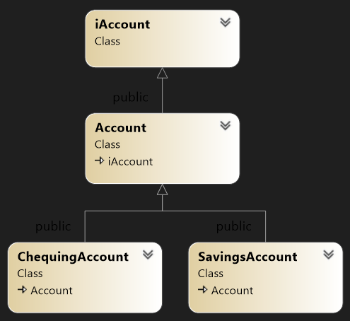

# Workshop 8: Virtual Functions and Abstract Base Classes

In this workshop, you are to implement an abstract definition of behavior for a specific type.

## Learning Outcomes

Upon successful completion of this workshop, you will have demonstrated the abilities to:

- define a pure virtual function
- code an abstract base class
- implement behavior declared in a pure virtual function
- explain the difference between an abstract base class and a concrete class
- describe what you have learned in completing this workshop


## General Instructions

### Submission Policy

This workshop is divided into one coding part and one non-coding part.

- **Part 1** (*LAB*): A *step-by-step* guided workshop, worth 50% of the workshop's total mark.
  Please note that the part 1 section is **not to be started in your first session of the week**. You should start it on your own before the day of your class and join the first session of the week to ask for help and correct your mistakes (if there are any).
- **reflection**: non-coding part. The reflection doesn't have marks associated with it but can incur a **penalty of max 40% of "Part 1" mark** if your professor deems it insufficient (you make your marks from the code, but you can lose some on the reflection).
  - Submissions of **Part 1** that do not contain the *reflection* (that is the **non-coding part**) are considered incomplete and are ignored.


### Due Dates

The due dates depend on your section. The due date for *Part #1* is at the end of the day when your lab is scheduled.

Please choose the `-due` option of the submitter program to see the exact due date of your section:

```bash
~profname.proflastname/submit 2??/wX/pY_SSS -due
```

- Replace `??` with your subject code (`00` or `44`)
- Replace `X` with workshop number: [`1` to `10`]
- Replace `Y` with the part number: [`1` or `2`]
- Replace `SSS` with the section identifier: [`naa`, `nbb`, `nra`, `zaa`, etc.]


### Late penalties

You are allowed to submit your work up to 2 days after the due date with 30% penalty for each day. After that, the submission will be closed, and the mark will be zero. If the reflection is missing when the submission closes, the mark for **Part 2** will be set to 0.


### Citation

Every file that you submit must contain (as a comment) at the top:

- **your name**,
- **your Seneca email**,
- **Seneca Student ID**,
- the **date** when you completed the work.


#### For work that is done entirely by you (ONLY YOU)

If the file contains only your work or the work provided to you by your professor, add the following message as a comment at the top of the file:

> I have done all the coding by myself and only copied the code that my professor provided to complete my workshops and assignments.


#### For work that is done partially by you

If the file contains work that is not yours (you found it online or somebody provided it to you), **write exactly which part of the assignment is given to you as help, who gave it to you, or which source you received it from**.  By doing this you will only lose the mark for the parts you got help for, and the person helping you will be clear of any wrongdoing.

- Add the citation to the file in which you have the borrowed code (make sure to clearly mark the code that is not created by you and where did you get it from).
- In the `reflect.txt` file, add a summary of the files/portions of code that is not yours (the source files should un-ambiguously identify the portions of code that are not yours).

> ⚠️ This [Submission Policy](#submission-policy) only applies to the workshops. All other assessments in this subject have their own submission policies.


#### If you have helped someone with your code

If you have helped someone with your code, let them know of these regulations and, in your `reflect.txt` file, write exactly which part of your code was copied and who was the recipient of this code. By doing this you will be clear of any wrongdoing if the recipient of the code does not honour these regulations.


### Compiling and Testing Your Program

All your code should be compiled using this command on `matrix`:

```bash
g++ -Wall -std=c++11 -g -o ws file1.cpp file2.cpp ...
```

- `-Wall`: the compiler will report all warnings
- `-std=c++11`: the code will be compiled using the C++11 standard
- `-g`: the executable file will contain debugging symbols, allowing *valgrind* to create better reports
- `-o ws`: the compiled application will be named `ws`

After compiling and testing your code, run your program as follows to check for possible memory leaks (assuming your executable name is `ws`):

```bash
valgrind --show-error-list=yes --leak-check=full --show-leak-kinds=all --track-origins=yes ws
```

- `--show-error-list=yes`: show the list of detected errors
- `--leak-check=full`: check for all types of memory problems
- `--show-leak-kinds=all`: show all types of memory leaks identified (enabled by the previous flag)
- `--track-origins=yes`: tracks the origin of uninitialized values (`g++` must use `-g` flag for compilation, so the information displayed here is meaningful).

To check the output, use a program that can compare text files.  Search online for such a program for your platform, or use *diff* available on `matrix`.

> Note: All the code written in workshops and the project must be implemented in the **seneca** namespace, unless instructed otherwise.


## Part 1 (100%)

Include in your solution all of the statements necessary for your code to compile under a standard C++ compiler and within the `seneca` namespace.

In this workshop, you create an inheritance hierarchy for the bank accounts of a bank’s clients. All clients can deposit (i.e., credit) money into their accounts and withdraw (i.e., debit) money from their accounts. Two specific types of accounts exist. Savings accounts earn interest on the money they hold. Checking accounts charge a fee per transaction (i.e., for every credit and debit).  

## Class Hierarchy:
The design of your **Account** hierarchy is illustrated in the following Figure. An interface named **iAccount** exposes the hierarchy’s functionality to a client module that uses its features. The abstract base class named **Account** holds the balance for an account, can credit and debit an account transaction and can expose the current balance in the account. The two account types derive from this base class. The **SavingsAccount** class and the **ChequingAccount** class inherit the properties and functionality of the **Account** base class. 



## Implementation

Implement the following classes:
1) `iAccount`  - the interface to your hierarchy – store it in a file named `iAccount.h`
2) `Account` - an abstract base class that manages the common operations – store its definition and implementation in files named `Account.h` and `Account.cpp`.
3) `SavingsAccount` – a concrete class – store its definition and implementation in files named `SavingsAccount.h` and `SavingsAccount.cpp.`
4) `ChequingAccount` – a concrete class – store its definition and implementation in files named `ChequingAccount.h` and `ChequingAccount.cpp`.
5) `the Allocator Module` (coded and provided) -  In a separate file named `allocator.cpp` the function that allocates dynamic memory for an account based on its dynamic type is provided. Study and understand this function before the final tester program. This function is to be declared in the `iAccount` Interface module (see below)

### `iAccount` Interface:
The iAccount interface includes the following pure virtual public member functions:

- `bool credit(double)` – adds a positive amount to the account balance 
- `bool debit(double)` – subtracts a positive amount from the account balance 
- `void monthEnd()` – applies month-end transactions to the account
- `void display(std::ostream&) const` – inserts account information into an ostream object

This interface also declares a public empty virtual destructor.  
This interface also declares the following helper function (this global function is already coded and is provided in the allocator module and will be used at final submission)

- `iAccount* CreateAccount(const char*, double)` – receives a C-style string identifying the type of account and the initial account balance, creates the account with the starting balance and returns its address.

### `Account` Class  (abstract base class)
The **Account** class derives from the **iAccount** interface.

### Attribute
The current balance (a double value);

### Public constructor and methods

- `Account(double)` – constructor receives either a double holding the initial account balance or nothing. If the amount received is not positive-valued or no amount is received, this function initializes the current balance to 0.0. If the amount received is positive-valued, this function initializes the current account balance to the received amount. 
- `bool credit(double)` – receives an amount to be credited (added) to the account balance and returns the success of the transaction. If the amount received is positive-valued, the transaction succeeds and this function adds the amount received to the current balance. If the amount is not positive-valued, the transaction fails and this function does not add the amount received.
- `bool debit(double)` – receives an amount to be debited (subtracted) from the account balance and returns the success of the transaction. If the amount received is positive-valued, the transaction succeeds and this function subtracts the amount received from the current balance. If the amount is not positive-valued, the transaction fails and this function does not subtract the amount received.

### Protected method

- `double balance() const` – returns the current balance of the account.


## `SavingsAccount` Class (concrete class)

The SavingsAccount class derives from the Account class and holds the interest rate that applies to the account. This class includes the following public member functions:
- `SavingsAccount(double, double)` – constructor receives a double holding the initial account balance and a double holding the interest rate to be applied to the balance. If the interest rate received is positive-valued, this function stores the rate. If not, this function stores 0.0 as the rate to be applied.
- `void monthEnd()` – this modifier calculates the interest earned on the current balance and credits the account with that interest.
- `void display(std::ostream&) const` – receives a reference to an ostream object and inserts the following output on separate lines to the object. The values marked in red are fixed format with 2 decimal places and no fixed field width:

```text
Account type: Savings
Balance: $xxxx.xx
Interest Rate (%): x.xx
```

## `ChequingAccount` Class (concrete class)

The **ChequingAccount** class derives from the **Account** class and holds the transaction fee and month-end fee to be applied to the account. 

### Attributes

- transaction fee (double)
- monthly fee (double)

### public constructor and methods

- `ChequingAccount(double, double, double)` – constructor receives a double holding the initial account balance, a double holding the transaction fee to be applied to the balance and a double holding the month-end fee to be applied to the account. If the transaction fee received is positive-valued, this function stores the fee. If not, this function stores 0.0 as the fee to be applied. If the monthly fee received is positive-valued, this function stores the fee. If not, this function stores 0.0 as the fee to be applied.
- `bool credit(double)` – this modifier credits the balance by the amount received and if successful debits the transaction fee from the balance. This function returns true if the transaction succeeded; false otherwise.
- `bool debit(double)` – this modifier debits the balance by the amount received and if successful debits the transaction fee from the balance. This function returns true if the transaction succeeded; false otherwise.
- `void monthEnd()` – this modifier debits the monthly fee from the balance, but does not charge a transaction fee for this debit.
- `void display(std::ostream&) const` – receives a reference to an ostream object and inserts the following output on separate lines to the object. The values marked in red are fixed format with 2 decimal places and no fixed field width:

```text
Account type: Chequing
Balance: $xxxx.xx
Per Transaction Fee: x.xx
Monthly Fee: x.xx
```

## The `Allocator` Module (provided)

The **Allocator** module pre-defines the accounts rates and charges and defines the global function **CreateAccount** that creates the Account object from the types of account available. The rates and charges are:

- interest rate 0.05 (5%)
- transaction fee 0.50
- monthly fee 2.00

###  `CreateAccount` global function 

- iAccount* CreateAccount (const char*, double) – this function receives the address of a C-style string that identifies the type of account to be created and the initial balance in the account and returns its address to the calling function. If the initial character of the string is ‘S’, this function creates a savings account in dynamic memory. If the initial character of the string is ‘C’, this function creates a chequing account in dynamic memory. If the string does not identify a type that is available, this function returns nullptr. 


### The `w8_p1` Module (provided)

This is the tester module and is fully provided. Look at it, make sure you understand it, but do not change it.


### Submission

Upload the header files (`*.h`), and source code files (`*.cpp`) to your `matrix` account. Compile and run your code using the `g++` compiler as shown above and test that everything works properly.  Using the provided tester module, a correct implementation will produce the output as shown in `sample_output.txt`.

Then, run the following command from your `matrix` account:

```bash
~profname.proflastname/submit 2??/wX/pY_SSS
```

- Replace `??` with your subject code (`00` or `44`)
- Replace `X` with workshop number: [`1` to `10`]
- Replace `Y` with the part number: [`1` or `2`]
- Replace **SSS** with the section: [`naa`, `nbb`, `nra`, `zaa`, etc.]
and follow the instructions.

> **⚠️Important:** Please note that a successful submission does not guarantee full credit for this workshop. If the professor is not satisfied with your implementation, your professor may ask you to resubmit. Re-submissions will attract a penalty!


### Reflection

Study your final solutions for each deliverable of the workshop, reread the related parts of the course notes, and make sure that you have understood the concepts covered by this workshop.  **This should take no less than 30 minutes of your time and the result is suggested to be at least 150 words in length.**

Create a **text** file named `reflect.txt` that contains your detailed description of the topics that you have learned in completing this particular workshop and **the project milestones** and mention any issues that caused you difficulty and how you solved them.

To avoid deductions, refer to code in your solution as examples to support your explanations.

You may be asked to talk about your reflection (as a presentation) in class.


### Submission

To test and demonstrate execution of your program use the same data as shown in the sample output.

Upload the header files (`*.h`), and source code files (`*.cpp`) to your `matrix` account. Compile and run your code using the `g++` compiler as shown above and test that everything works properly.  Using the provided tester module, a correct implementation will produce the output as shown in `sample_output.txt`.

```bash
~profname.proflastname/submit 2??/wX/pY_SSS
```

- Replace `??` with your subject code (`00` or `44`)
- Replace `X` with workshop number: [`1` to `10`]
- Replace `Y` with the part number: [`1` or `2`]
- Replace `SSS` with the section identifier: [`naa`, `nbb`, `nra`, `zaa`, etc.]

and follow the instructions.

> **⚠️Important:** Please note that a successful submission does not guarantee full credit for this workshop. If the professor is not satisfied with your implementation, your professor may ask you to resubmit. Re-submissions will attract a penalty.


<!--🔜 COMING SOON-->
